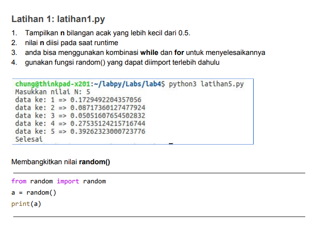
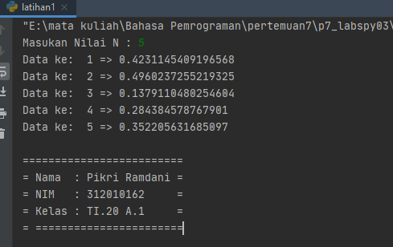
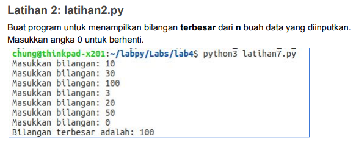

# p7_labspy03
Repository ini di buat untuk memenuhi tugas pada pertemuan ke 7- praktikum 3 <br><br>
Nama    : Pikri Ramdani<br>
NIM     : 312010162<br>
Kelas   : TI.20.A.1<br>
<hr>

### Alur Algoritma latihan 1.py
<hr>
<br>

<br>

Berikut Source code perintah diatas yang saya tulis untuk menjadikan aplikasi tersebut.

``` python
n=int(input("Masukan Nilai N : "))

import random

for x in list(range(1,n+1,1)):
    print("Data ke: ",x,"=>",random.uniform(0, 0.5))

print()
```
Dari source code diatas akan saya jelaskan beberapa syntax atau functionnya.
 
 *  **import random** berfungsi untuk memanggil library random, dimana random berfungsi untuk menentukan pilihan secara acak.
 *  **nilai = int(input("Masukan Nilai n : "))** Untuk menginputkan nilai berupa interger
 *  **range()** Berfungsi untuk menghasilkan list.
 *  **random.uniform** digunakan untuk menampilkan bilangan float random dengan batas awal bilangan x dan batas akhir bilangan y.
 *  **("Data ke: ",a,"=>",random.uniform(0, 0.5))** Untuk Menampilkan Otput data
 
 hasil Outputnya:<br><br>
 
 

### Alur Algoritma Latihan 2    
<hr>
<br>
 
Pada bagian ini saya akan menyelesaikan tugas dari dosen dalam materi latihan 2, seperti gambar dibawah ini<br>

    
    
    
    
